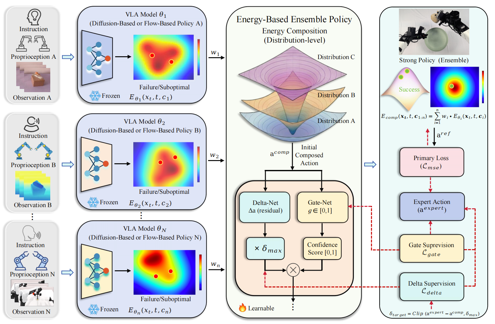

<div align="center">

# EnsembleVLA: Ensemble Learning for Vision-Language Action Models

<div>
Mingchen&nbsp;Song<sup>1 2</sup>,
<a target="_blank" href="https://homepage.hit.edu.cn/dengxiang">Xiang&nbsp;Deng</a><sup>1 3</sup>,
Jie&nbsp;Wei<sup>1</sup>,
<a target="_blank" href="https://scholar.google.com/citations?hl=en&user=Awsue7sAAAAJ">Dongmei&nbsp;Jiang</a><sup>2</sup>,
<a target="_blank" href="https://scholar.google.com/citations?hl=en&user=yywVMhUAAAAJ">Liqiang&nbsp;Nie</a><sup>1</sup>,
<a target="_blank" href="https://ieeexplore.ieee.org/author/37087008154">Weili&nbsp;Guan</a><sup>1 3</sup>
</div>
<sup>1</sup>Harbin Institute of Technology, Shenzhen&nbsp;&nbsp;
<sup>2</sup>PengCheng Laboratory&nbsp;&nbsp;
<sup>3</sup>Shenzhen Loop Area Institute
<br>
<br><br>
<a href="#"></a>
<a href="https://github.com/MingC715/EnsembleVLA" target="_blank"></a>
<a href="https://huggingface.co/mingchens/EnsembleVLA" target="_blank"></a>

</div>

## Introduction

We propose **EnsembleVLA**, an energy-based ensemble policy framework for
composing Vision-Language-Action policies in RoboTwin2 manipulation tasks.
Instead of training a single monolithic policy, EnsembleVLA keeps multiple
pretrained VLA policies frozen and treats their action predictions as
energy-based candidates. A lightweight learnable composer then combines these
candidates at the action-distribution level, producing a stronger policy that
can inherit complementary strengths from diffusion-based and flow-based models.

The framework supports heterogeneous policy composition and keeps evaluation
close to the original RoboTwin2 rollout interface. During evaluation, each base
policy proposes actions from its own observation and instruction context;
EnsembleVLA computes a composed action through energy aggregation and a learned
residual/gating head, then executes the composed action in the simulator.

<div align="center">

</div>

## Environment Setup

This project should be installed on top of a working RoboTwin2 environment. Please
first follow the official RoboTwin2 documentation for installation, asset download,
configuration files, and policy evaluation:

- RoboTwin2 documentation: https://robotwin-platform.github.io/doc/index.html


A typical setup is:

```bash
git clone https://github.com/MingC715/EnsembleVLA.git
cd EnsembleVLA

conda create -n RoboTwin python=3.10 -y
conda activate RoboTwin

mkdir -p external
git clone https://github.com/RoboTwin-Platform/RoboTwin.git external/RoboTwin
cd external/RoboTwin
bash script/_install.sh
bash script/_download_assets.sh
python script/update_embodiment_config_path.py
cd ../..
```

After RoboTwin2 is installed, make the assets visible to this repository and check
that the task, camera, and embodiment configuration files point to your local
installation:

```bash
ln -s /path/to/RoboTwin/assets assets
```

Recommended runtime variables for headless GPU evaluation are:

```bash
export PYOPENGL_PLATFORM=egl
export MUJOCO_GL=egl
export SAPIEN_OFFSCREEN_ONLY=1
export NVIDIA_DRIVER_CAPABILITIES=compute,utility,graphics
export TORCH_EXTENSIONS_DIR=${TORCH_EXTENSIONS_DIR:-$HOME/.cache/torch_extensions}
```

The base policy backends should be available under `policy/`:

```text
policy/DP/       # Diffusion Policy backend
policy/DP3/      # 3D Diffusion Policy backend
policy/pi05/     # pi0.5 / openpi backend
```

Install any additional backend dependencies required by the policies you evaluate,
following the RoboTwin2 policy pages and the corresponding upstream repositories.

## Checkpoints

We release the EnsembleVLA checkpoints and base policy weights on Hugging Face:
[mingchens/EnsembleVLA](https://huggingface.co/mingchens/EnsembleVLA).
After downloading the release assets, place or symlink them under
`best_checkpoint/` using the layout below.

Download with Git LFS:

```bash
git lfs install
git clone https://huggingface.co/mingchens/EnsembleVLA hf_assets
rsync -a hf_assets/best_checkpoint/ best_checkpoint/
```

Expected best-checkpoint layout:

```text
best_checkpoint/
+-- dp+dp3/<task>/
|   +-- ensemble_checkpoint/best.pt
|   +-- base_dp/<ckpt>.ckpt
|   +-- base_dp3/<ckpt>.ckpt
+-- dp+pi0.5/<task>/
    +-- ensemble_checkpoint/best.pt
    +-- base_dp/<ckpt>.ckpt
    +-- base_pi05_checkpoint_dir/
        +-- model.safetensors
        +-- metadata.pt
        +-- assets/<task>/norm_stats.json
```

Only inference checkpoints are required for evaluation. See `docs/checkpoints.md`
for the checkpoint manifest and Hugging Face layout.

## Results

The table reports the best public-code 100-episode evaluation observed with the
released checkpoints. Physics simulation and motion planning can introduce small
run-to-run variation.

### DP + DP3

| Task | Ensemble checkpoint | Result |
| --- | --- | ---: |
| `beat_block_hammer` | `best_checkpoint/dp+dp3/beat_block_hammer/ensemble_checkpoint/best.pt` | 98/100 |
| `open_laptop` | `best_checkpoint/dp+dp3/open_laptop/ensemble_checkpoint/best.pt` | 93/100 |
| `click_alarmclock` | `best_checkpoint/dp+dp3/click_alarmclock/ensemble_checkpoint/best.pt` | 100/100 |
| `move_playingcard_away` | `best_checkpoint/dp+dp3/move_playingcard_away/ensemble_checkpoint/best.pt` | 89/100 |
| `place_bread_skillet` | `best_checkpoint/dp+dp3/place_bread_skillet/ensemble_checkpoint/best.pt` | 57/100 |
| `dump_bin_bigbin` | `best_checkpoint/dp+dp3/dump_bin_bigbin/ensemble_checkpoint/best.pt` | 89/100 |
| `handover_block` | `best_checkpoint/dp+dp3/handover_block/ensemble_checkpoint/best.pt` | 70/100 |
| `stack_bowls_three` | `best_checkpoint/dp+dp3/stack_bowls_three/ensemble_checkpoint/best.pt` | 76/100 |

### DP + pi0.5

All results below use the released DP + pi0.5 evaluation mode with PyTorch pi0.5,
100 evaluation episodes, and expert-check enabled. `handover_block` uses the
pi0.5-2000 base checkpoint; the other tasks use pi0.5-1000.

| Task | Ensemble checkpoint | Result |
| --- | --- | ---: |
| `beat_block_hammer` | `best_checkpoint/dp+pi0.5/beat_block_hammer/ensemble_checkpoint/best.pt` | 74/100 |
| `open_laptop` | `best_checkpoint/dp+pi0.5/open_laptop/ensemble_checkpoint/best.pt` | 93/100 |
| `click_alarmclock` | `best_checkpoint/dp+pi0.5/click_alarmclock/ensemble_checkpoint/best.pt` | 98/100 |
| `move_playingcard_away` | `best_checkpoint/dp+pi0.5/move_playingcard_away/ensemble_checkpoint/best.pt` | 89/100 |
| `place_bread_skillet` | `best_checkpoint/dp+pi0.5/place_bread_skillet/ensemble_checkpoint/best.pt` | 55/100 |
| `dump_bin_bigbin` | `best_checkpoint/dp+pi0.5/dump_bin_bigbin/ensemble_checkpoint/best.pt` | 78/100 |
| `handover_block` | `best_checkpoint/dp+pi0.5/handover_block/ensemble_checkpoint/best.pt` | 39/100 |
| `stack_bowls_three` | `best_checkpoint/dp+pi0.5/stack_bowls_three/ensemble_checkpoint/best.pt` | 53/100 |

## Evaluation

DP + DP3 example:

```bash
conda activate RoboTwin
bash policy/Ensemble-Policy-easy/eval_wlearn.sh \
  beat_block_hammer DP DP3 0 best L515 100 0 100 300 3000 \
  best_checkpoint/dp+dp3/beat_block_hammer/ensemble_checkpoint
```

DP + pi0.5 example:

```bash
conda activate RoboTwin
bash policy/Ensemble-Policy-easy/eval_wlearn.sh \
  click_alarmclock DP pi05 0 best L515 100 0 100 100 1000 \
  best_checkpoint/dp+pi0.5/click_alarmclock/ensemble_checkpoint
```

Arguments:

```text
task policy1 policy2 gpu ensemble_ckpt camera data_num seed test_num policy1_ckpt policy2_ckpt output_dir [composition_mode] [policy2_use_pytorch]
```

For DP + pi0.5 evaluation, pass the released composition mode argument used by
`eval_wlearn.sh` and set `policy2_use_pytorch=true`.

## Project Structure

```text
EnsembleVLA-ICML2026/
+-- README.md
+-- docs/
|   +-- checkpoints.md
+-- description/
+-- envs/
+-- task_config/
+-- script/
|   +-- eval_policy.py
+-- policy/
|   +-- DP/
|   +-- DP3/
|   +-- pi05/
|   +-- Ensemble-Policy-easy/
|       +-- composition.py
|       +-- energy_head.py
|       +-- eval.py
|       +-- eval_wlearn.py
|       +-- eval_wlearn.sh
+-- best_checkpoint/
    +-- dp+dp3/
    +-- dp+pi0.5/
```

## Acknowledgement

We thank the open-source projects [RoboTwin2](https://robotwin-platform.github.io/doc/index.html)
and [GPC](https://github.com/SageCao1125/GPC) for making their code and tools publicly available.

## Citation

```bibtex
@inproceedings{song2026ensemblevla,
  title={EnsembleVLA: Ensemble Learning for Vision-Language Action Models},
  author={Song, Mingchen and Deng, Xiang and Wei, Jie and Jiang, Dongmei and Nie, Liqiang and Guan, Weili},
  booktitle={International Conference on Machine Learning},
  year={2026}
}
```
